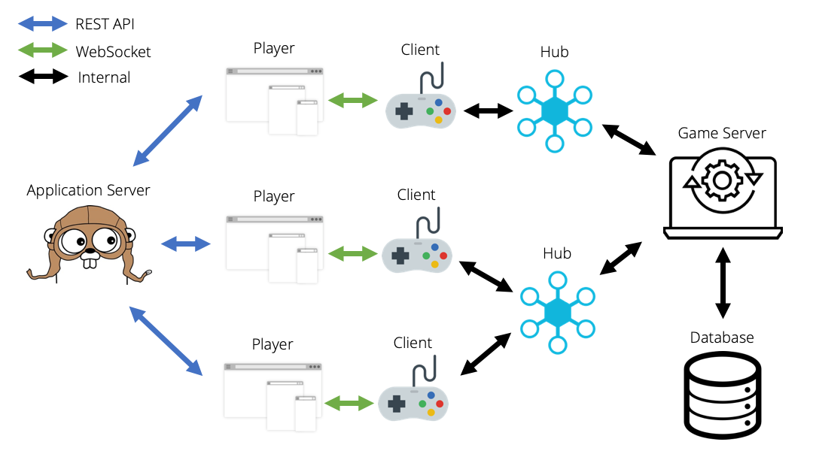

# Game Sharing Service
This is a proof-of-concept game streaming platform that allows players to jump into different games without any client-side processing. Since all game information is stored in the server, players can share the exact state of their play-through with other users, allowing anyone to experience games from the same moment.

I was inspired by [Stadia](https://stadia.dev), envisioning a future where content creators can share what they are playing in a video or livestream, and let viewers experience it too! I think that another advantage of the game streaming model is that it allows for open-world MMORPGs of an extremely large scale.

This project is still in the works! As of now, the skeleton of the backend service is in place, using RESTful APIs and WebSocket to communicate with clients. I am currently wrapping up integration with a Redis database, and am planning on creating a simple frontend UI to demo the service!

## Architecture


**Entities:**
- Player (Web browser)
    - Only receives display output; does not do any game processing
- Client (WebSocket middleman)
    - Relays game input and output from the Hub to the Player
    - Can change which Hub it is subscribed to, thus changing which game is currently being played
- Hub (Client manager)
    - Manages one or many clients playing together
    - Receives inputs and publishes display data from/to each of its Clients
    - Sends information about the current game being played to the Game Server
- Game Server (Processor)
    - Essentially an individual game that players can choose from
    - Meant to be separate - as long as it implements the generic Game Server interface, the game will be playable
    - Processes game data for all Hubs
    - Manages saving/loading to the Database
- Application Server (Platform manager)
    - Processes REST API calls related to user information
- Database
    - Can be separate databases for each Game Server, but is currently just one

## Technology choices
The backend is written in [Go](https://golang.org). I chose Go because it was designed for large-scale cloud infrastructures. Its support for concurrency was perfect for the type of processing needed in game streaming. The [mux package](https://godoc.org/github.com/gorilla/mux) was used to create REST API endpoints, and the [websocket package](https://godoc.org/github.com/gorilla/websocket) was used for WebSocket communication.

The REST API endpoints are used to manage application/user information, while the WebSocket connection is used to pass input/output for the game currently being played. This separation was introduced to increase efficiency in communication between the web browser and the server.

I chose [Redis](https://redis.io) as a database because of its quick speed and scalability. Its key-value system turned out to be really easy to use because the information being stored is largely separate from one another.

## API Documentation

### [GET] `/games`
*Description: Returns an index of available games to play.*

Response Class (Status 200)

Example of a successful response:

```
{

}
```

Response Content Type: `application/json`

### [GET] `/games/{id}/{userID}`
*Description: Returns a user's saved states for a particular game.*

Example of a successful response:

```
HTTP/1.1 200 OK
Content-Type: application/json

{

}
```

Parameters:
Path | Type | Description
--- | --- | ---
id | String | The game's unique identifier
userID | String | The user's unique identifier

### [PUT] `/games/{id}/{userID}`


### [GET] `/games/{id}/{userID}/{stateID}`


### [PUT] `/games/{id}/{userID}/{stateID}`

### [POST] `/login/{id}`


